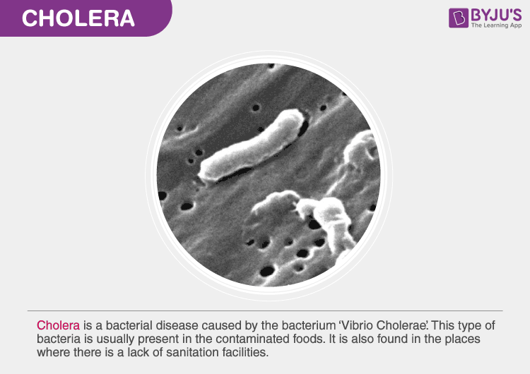

## Stockholm Cholera Outbreak Analysis

****
## Introduction
Welcome to a journey back in time to the fateful year of 1853 in Stockholm, Sweden. It was a year marked by a chilling menace that swept through the city, forever etching its story into the annals of history. The cholera outbreak of 1853, a stark chapter in the city's past, left an indelible mark on the population. In this analysis, we turn our attention to a haunting statistic- the death rate. Join us as we unravel the narrative of tragedy that unfolded during that fateful summer in 1853.

## Problem Statement
- What are the death rates among various age groups?
- What is the temporal progression of monthly death rate?
- What are the potential disparities in death among different genders?

## Skills

 - Data Modeling
 - Dax
 - Data Visualization
 - Dashboard Creation
 - Data Import and Transportation
 - Data Cleaning and Preprocessing
 - Problem Solving

## Data Exploration
At this stage, I begin to familiarize myself with the data. I address missing and inconsistent data to ensure the accuracy of my analysis, I compare and contrast death rates between different genders and visualize these differences. I also break down the death data into age band and visualize the death rates within each band.

## Data Cleaning and Preprocessing
- I identified and remove duplicate entries from death rate column to prevent skewing my analysis with redundant            information.
- I successfully formatted the monthly data column into a date format.
- I corrected data entry errors and anomalies that have occurred during data recording.

  
## Visualization and Analysis

- The analysis disclosed that September recorded the highest mortality rate with 180 deaths.
- Regarding gender-specific impacts, the data reveals that cholera had a more pronounced effect on women with 130 cases,    in contrast to 118 cases among men.
- Most of the fatalities, totaling 95, were observed among young adults, followed by 53 among children, 38 among old.       adults, 33 among youths, 18 among the elderly, and 11 among 
  teenagers.
  
## Recommendations
- For the unusually high mortality rates in October and November, health authorities should investigate the cause and       consider implementing targeted health interventions or public 
  health awareness campaigns during these months to reduce mortality.
- Regarding gender-specific impacts, th higher number of cholera cases among women suggests the need for gender-sensitive   healthcare strategies and awareness programs. Tailored 
  initiatives should be developed to ensure women have bettr access to preventionn and treatment.
- For the distribution of fatalities across age groups, focusing on the protection and healthcare support for young         adults and children is essential, as they are the most affected 
  groups. Efforts should be made to understand and address the specific healths risks and vulnerabilities faced by these    age categories.
  
## Conclusion
The cholera outbreak analysis has revealed distinct patterns in mortality rates, gender-specific impacts, and age group vulnerabilities. October and November exhibit alarmingly high mortality rates, warranting further investigation and targeted interventions. 
Cholera's disproportionate impact on women necessitates gender-sensitive healthcare solutions. 
Addressing the needs of young adults and children is of paramount importance to reduce the overall mortality rate and improve public health outcomes. 
This data-driven approach can guide more effective healthcare policies and strategies to save lives and improve public health outcomes.
